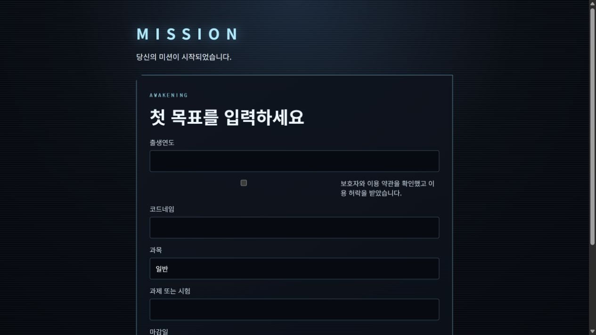

<!-- JUWON-PORTFOLIO-INTRO:START -->
# JUWON SYSTEM



*Recorded Mission Web UI preview from the JUWON SYSTEM family; not an Electron screenshot. Mission server not connected.*

*JUWON SYSTEM 계열의 Mission Web 빌드 · Electron 화면이 아님 · 미션 서버 미연결*

## English

A Windows-local project and quest tracking prototype, with an Electron app and a separate Mission Web interface. It records project deliverables, not judgments about personal habits.

[View JUWON's portfolio](https://jupt.pages.dev/) · [Browse the project collection](https://jupt.pages.dev/projects)

**Scope:** This README presents the repository's documented intent and recorded visual evidence. It does not certify that every feature is complete, deployed, or currently working. Follow the original setup, safety, and license documentation below.

This repository is a selected original-source snapshot. The recorded source fingerprint describes the initial publication; this portfolio introduction was added afterward. Original technical documentation is preserved below.

## 한국어

개인 성장·퀘스트 관리 Electron 앱과 별도 Mission Web.

[JUWON 포트폴리오 보기](https://jupt.pages.dev/) · [전체 프로젝트 보기](https://jupt.pages.dev/projects)

**확인 범위:** 저장소의 문서상 목적과 기록된 화면 근거를 소개합니다. 모든 기능의 완성·배포·현재 정상 작동을 보증하지 않습니다. 설치법·안전 주의사항·라이선스는 아래 기존 문서를 확인하세요.

선택된 원본 소스의 공개 스냅샷입니다. 기록된 소스 지문은 최초 공개 시점을 나타내며, 이 포트폴리오 소개는 이후 추가했습니다. 기존 기술 문서는 아래에 보존했습니다.
<!-- JUWON-PORTFOLIO-INTRO:END -->

---

## Original documentation / 기존 문서

# JUWON SYSTEM

Windows용 로컬 프로젝트 진행 시스템이다. 생활 습관을 평가하지 않으며 프로젝트 결과물만 기록한다.

## 실행과 검증

```powershell
rtk npm install
rtk npm run dev
rtk npm run typecheck
rtk npm run test:run
rtk npm run build
rtk npm run test:e2e
rtk npm run package
```

`npm run package`는 `release/`에 Windows x64 설치 파일과 unpacked 앱을 만든다. 관리자 권한, 자동 시작, 방화벽 변경, 보안 예외를 요청하지 않는다.

## 화면

- A — `PLAYER STATUS`: 시작 화면. 플레이어 레벨, YouTube·Vibe Coding·Business 능력치, 활성 Gate, 현재 퀘스트.
- B — `QUEST DETAIL`: A의 현재 퀘스트를 클릭해 연다. 목표, 단계, 고정 보상, 증거 제출.
- C — `PROJECT COMMAND`: `PROJECTS` 버튼으로 필요할 때만 연다. ACTIVE, SHADOW, LOCKED, CLEARED 프로젝트 목록.

## 데이터와 백업

데이터는 Electron의 Windows `userData` 폴더 안 `juwon-system.db`에 저장된다. 같은 폴더의 `backups/`에는 하루 한 번 `system-YYYY-MM-DD.db`가 생성되며 최신 7개만 유지된다. 증거 원본 파일은 복사하거나 삭제하지 않는다.

DB가 손상되면 앱을 닫고 다음 순서로 복구한다.

1. `juwon-system.db`, `juwon-system.db-wal`, `juwon-system.db-shm`을 별도 폴더로 이동해 보존한다.
2. `backups/`의 가장 최신 `system-YYYY-MM-DD.db`를 복사한다.
3. 복사본 이름을 `juwon-system.db`로 바꾼다.
4. 앱을 다시 연다.

원본이나 백업을 삭제하지 말고 먼저 복사본으로 복구한다.

## 진행 규칙

- ACTIVE 프로젝트 최대 1개, SHADOW 자동화 프로젝트 최대 1개.
- 능력치는 YouTube, Vibe Coding, Business만 존재한다.
- 퀘스트 XP와 능력치 배분은 시작할 때 고정된다.
- 증거 제출 뒤 검토가 완료되어야 XP가 한 번 지급된다.
- 실패하거나 미룬 퀘스트에 마이너스 XP나 수치심 문구를 사용하지 않는다.

현재 Core 패키지에는 Codex Bridge, Safe Controller, Chrome Focus Guard가 들어 있지 않다. 따라서 임의 명령 실행, Chrome·OBS 제어, 웹사이트 차단 기능도 아직 없다.
